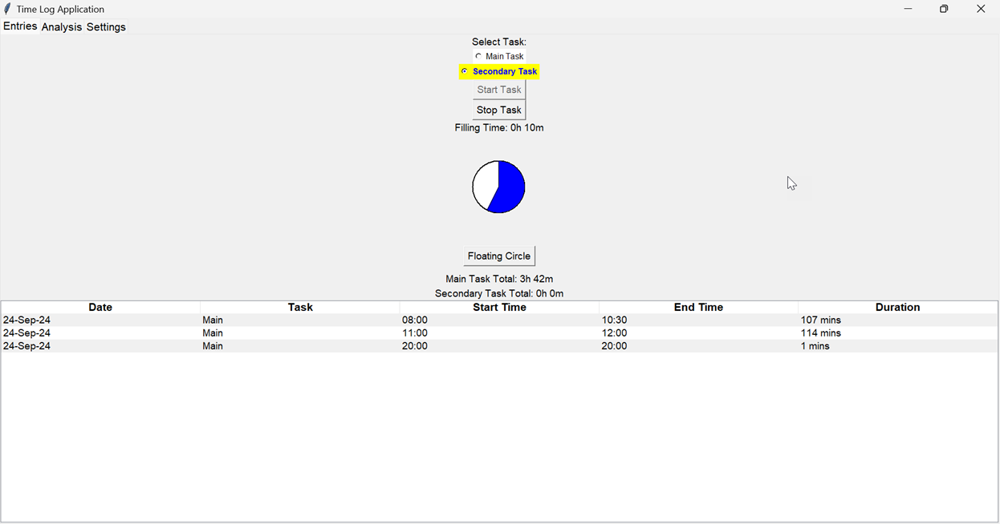
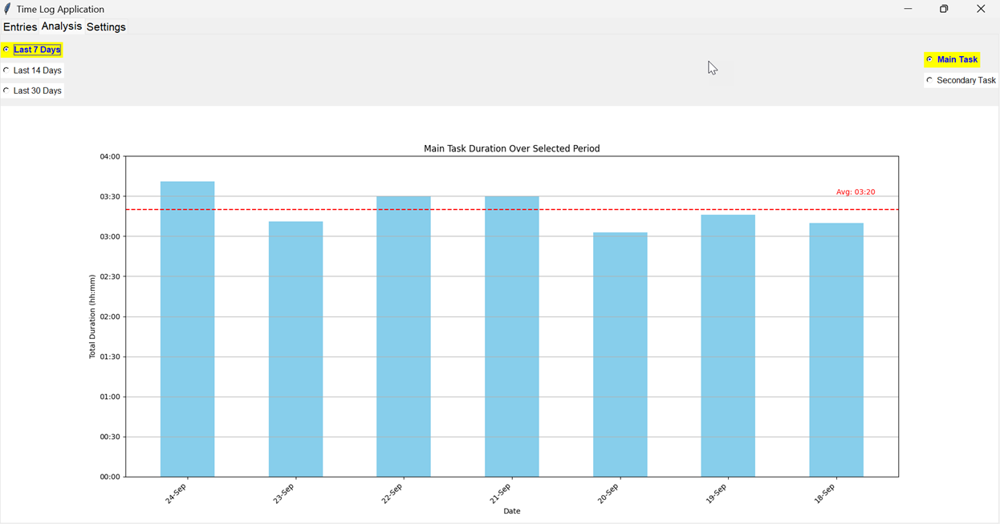
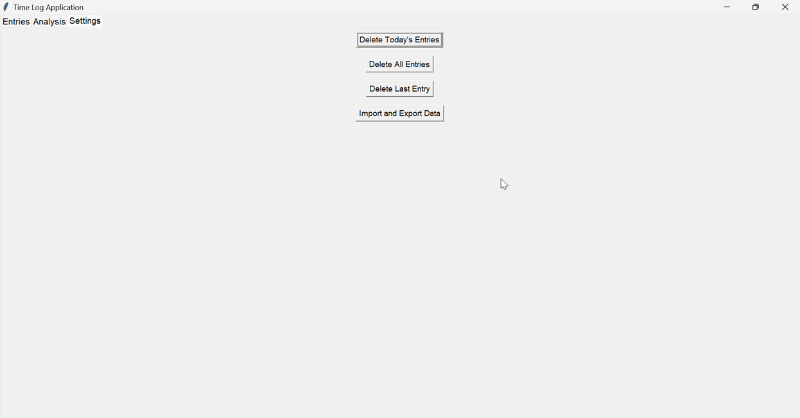
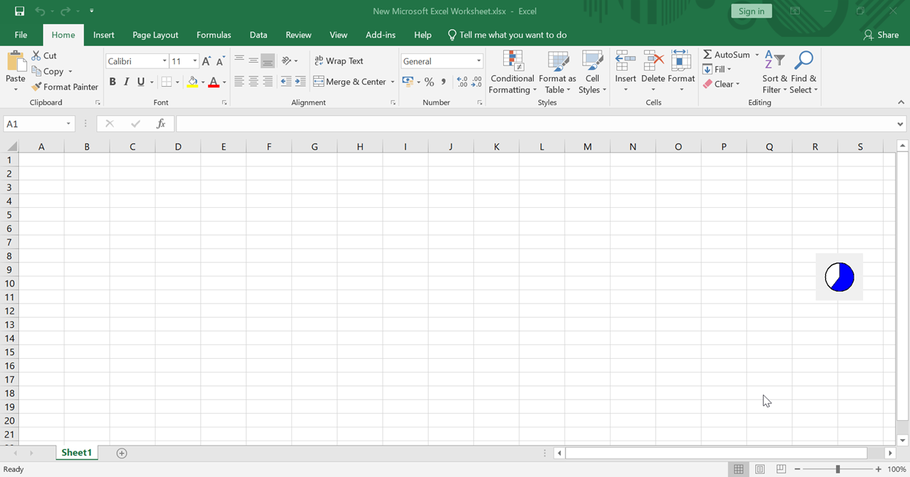

# Focus Time Log & Analysis App

This Python-based desktop application was **entirely developed using ChatGPT** as a learning project to improve the understanding of AI-assisted development, as well as to explore data analysis and productivity tracking. The application is built with **Tkinter** and tracks time spent on tasks, providing insights into focus patterns through data collection and visualization.

Designed as a personal productivity tool, this project demonstrates key skills relevant to a **Data Analyst** role, including data collection, analysis, visualization, and automation.

## Key Features:

### 1. Task Categorization & Time Tracking:
- Tracks sessions under two categories: **Main Task** and **Secondary Task**.
- Logs and displays total time spent on tasks for the current date, enabling precise data collection for daily productivity analysis.
  

### 2. Time Log Analysis & Visualization:
- Automatically calculates and displays time logged over the past 7, 14, and 30 days.
- Uses a column chart to visually represent:
  - **Total time** spent on each task during these periods.
  - **Average task duration** over time, offering quick insights into focus trends and patterns.
- Demonstrates the ability to gather, manipulate, and present data using visual tools to draw actionable insights.

  

### 3. Focus Timer for Gradual Improvement:
- Implements an analog countdown timer based on the **average focus duration** over the past 7 days, with a 10-minute extension to gradually enhance focus duration.
- Provides practical insights into time management and improving productivity by leveraging historical data.

### 4. Comprehensive Data Management:
- Allows users to:
  - Record multiple logs for the current date.
  - View total duration of all sessions.
  - Delete the last entry, reset data for the current day, or clear all entries for a fresh start.
- Supports importing data from Excel files for broader data analysis, demonstrating experience in handling and integrating data from various sources.

### 5. Floating Timer Window:
- A **floating window** displays a small analog countdown timer, which users can move and place on top of other applications. 
- This feature allows users to track their remaining focus time without switching windows or interrupting other work.
- Enhances user convenience by making the focus timer visible at all times, promoting better focus and time management.

### 6. Personal Focus Pattern Analysis:
- The application serves as a data collection tool to analyze personal productivity, enabling the identification of focus patterns and trends over time.
- These insights are used to fine-tune time management strategies, demonstrating the ability to derive meaningful conclusions from data.

## Project Goals:

### Data Collection & Analysis:
This app collects time-tracking data, allowing for structured analysis of personal focus patterns, which is directly applicable to data analysis roles. Hands-on experience with **data manipulation, trend identification, and pattern analysis** was gained through the project.

### Data Visualization:
Using Python’s Tkinter and visualization libraries, the project demonstrates the ability to **create visual dashboards** that effectively communicate key metrics such as task duration and averages, crucial in data analysis and reporting.

### AI Interaction & Learning:
The project also served as a practical experience to improve communication with AI tools like ChatGPT. By refining prompts and interacting with the AI, a deeper understanding of how to use AI to streamline problem-solving was developed, an emerging skill set in the field of data analysis.

## Relevance to Data Analyst Role:

Through the development of this app, the following skills were honed:
- **Data collection, processing, and analysis** using Python.
- **Data visualization** to present insights clearly and effectively.
- **Identifying trends and patterns** through data-driven metrics to enhance focus and productivity.
- **Automation** for time tracking and data handling, streamlining the process of data analysis.
- **Excel integration**, ensuring compatibility with commonly used data formats in the industry.

This project showcases the ability to manage data, extract meaningful insights, and present these insights in a way that supports decision-making. It also reflects a commitment to learning and applying tools that improve both personal productivity and analytical outcomes.

### Technologies Used:
- **Python (Tkinter)** for UI design and functionality.
- **Matplotlib** for data visualization.
- **Pandas** for data management and Excel integration.
- **ChatGPT** for AI-assisted development and learning.
